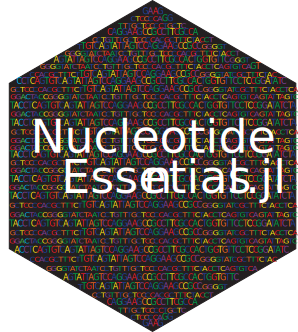

#  Nucleotide_Essentials.jl

[](https://github.com/phorve/Nucleotide_Essentials.jl/actions/workflows/CI.yml)
[](https://github.com/phorve/Nucleotide_Essentials.jl/actions/workflows/Runtests.yml)
[](https://codecov.io/gh/phorve/Nucleotide_Essentials.jl)

**Nucleotide_Essentials.jl** is a collection of tools for working with next-generation sequencing reads currently under development and testing.

## Installation:

Active development is still underway but the most current version can be downloaded from the REPL using: 
```julia 
using Pkg; Pkg.add(url = "https://github.com/phorve/Nucleotide_Essentials.jl")
```
## Current Functions: 
* `readFastq` - Import a .fastq file into Julia
* `readFasta` - Import a .fasta file into Julia
* `writeFasta` - Write a .fasta or .fasta.gz to file
* `FastqtoFasta` - Convert a .fastq file or FastqRecord to a FastaRecord
* `potential_mismatches` - Create a list of potential mismatch barcodes (mutations + deletions)
* `demultiplex_se` - Demultiplex single-end Illumina reads
* `demultiplex_pe` - Demultiplex paired-end Illumina reads
* `PlotQuality` - Visualize quality of .fastq file

Full documentation can be found at [here](https://www.patrickfhorve.com/Nucleotide_Essentials.jl/dev/)